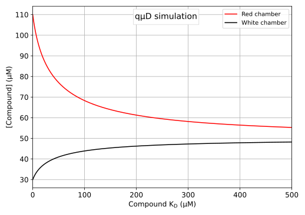
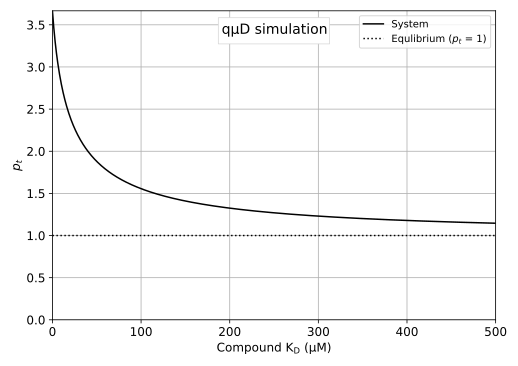
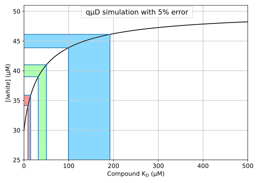

# Microdialysis (qµD)


Functions for simulation of quantitative microdialysis (qµD) experiments, as described and used in the recently submitted MDPI Methods and Protocols manuscript 
:

"*Quantitative Microdialysis for Rapid Affinity Determination of Small
Molecules to Target Proteins and for Exclusion of Compounds with Poor
Physicochemical Properties.*" - Currently under review

## Installation and requirements

The main simulation code is contained within microdialysis_equations.py and requires nothing but Numpy and Python. It is not intended to be a Python module, but rather, useable within different projects without installation.  The demonstration programs require:
- Python >= 3.7
- Numpy >= 1.18.5
- matplotlib >= 3.2.1
- uncertainties >= 3.1.4
- autograd >= 1.3

## Programs
Whilst microdialysis_equations.py contains code to integrate simulations into custom processes, the following demonstration programs are available, and also produce the plots used in the submitted publication.

----

#### 01_simulate_qud_concentrations.py
This program allows single point simulation of qµD experiments.  Looking through the code should allow the reader to familiarise themselves with the available qµD functions.

----

#### 02_plot_KDvsConcentrations.py
Program to simulate compound concentration in the red and white chambers as a function of K<sub>D</sub>.  Produces figure 1 as shown in paper.


---

####  03_deriveKD_from_lred.py
#### 03_deriveKD_from_lwhite.py
#### 03_deriveKD_from_pt.py

Example programs enabling the determination of K<sub>D</sub>s from experimental observations.

---
#### 04_deriveKD_from_multiple_lred.py
#### 04_deriveKD_from_multiple_lwhite.py
#### 04_deriveKD_from_multiple_pt.py

Example programs enabling the determination of K<sub>D</sub>s from multiple experimental observations.  Standard deviations are managed by the Python Uncertaincies library.

---

#### 05_plot_KDvsPt.py
Program to simulate *p<sub>t</sub>* as a function of K<sub>D</sub>. Produces figure 2 as shown in paper.



---

#### 06_calc_derivatives.py

Derivatives of system K<sub>D</sub> determination with respect to *lred*, *lwhite* and *p<sub>t</sub>*.  Used to produce table 1 in the manuscript and determine *lred* should be used for K<sub>D</sub> determination.  However, practically, this will contain protein as well as compound, meaning that extra steps must be taken in the determination of compound concentration.  We therefore recommend as standard, that K<sub>D</sub> determination proceeds using *lwhite*.

---

#### 07_plot_conc_to_kd_accuracy.py

Produce a plot illustrating the effect of a 5% measurement error in K<sub>D</sub> determination for *lred*, *lwhite* and *p<sub>t</sub>*.  Produces figure 3 as shown in paper.



---

#### microdialysis_equations.py

Contains functions for simulation of qµD system behaviour.

```python
def qud_lred(t0: float, l0: float, kdtl: float, redvol: float, whitevol: float, pc: float):
    """Calculate the compound concentration in the red chamber in a partially equlibrated system

    Args:
        t0 (float): Target concentration (in the red chamber)
        l0 (float): Ligand concentration, over the entire volume of red and white chambers when fully equilibrated.
        kdtl (float): Kd of target-ligand interaction
        redvol (float): Volume of the red chamber
        whitevol (float): Volume of the white chamber
        pc (float): Pc - Ligand partition coefficient in the absence of protein (control)

    Returns:
        float: Ligand concentration in the red chamber
```


```python
def qud_lwhite(t0: float, l0: float, kdtl: float, redvol: float, whitevol: float, pc: float):
    """Calculate the compound concentration in the white chamber in a partially equlibrated system

    Args:
        t0 (float): Target concentration (in the red chamber)
        l0 (float): Ligand concentration, over the entire volume of red and white chambers when fully equilibrated.
        kdtl (float): Kd of target-ligand interaction
        redvol (float): Volume of the red chamber
        whitevol (float): Volume of the white chamber
        pc (float): Pc - Ligand partition coefficient in the absence of protein (control)

    Returns:
        float: Ligand concentration in the white chamber
    """

```

```python
def qud_pt(t0: float, l0: float, kdtl: float, redvol: float, whitevol: float, pc: float):
    """Calculate the pt value in a partially equlibrated system

    Args:
        t0 (float): Target concentration (in the red chamber)
        l0 (float): Ligand concentration, over the entire volume of red and white chambers when fully equilibrated.
        kdtl (float): Kd of target-ligand interaction
        redvol (float): Volume of the red chamber
        whitevol (float): Volume of the white chamber
        pc (float): Pc - Ligand partition coefficient in the absence of protein (control)

    Returns:
        float: pt value
    """
    return (kdtl*pc*redvol - l0*pc*redvol + pc*redvol*t0 - kdtl*whitevol - l0*pc*whitevol + sqrt((-(kdtl*pc*redvol) + l0*pc*redvol - pc*redvol*t0 + kdtl*whitevol + l0*pc*whitevol)**2 - 4*kdtl*redvol*(-(l0*pc**2*redvol) - kdtl*pc*whitevol - l0*pc**2*whitevol - pc*t0*whitevol)))/(2.*kdtl*redvol)
```

```python
def qud_Kd_from_pt(pt: float, t0: float, l0: float, redvol: float, whitevol: float, pc: float):
    """Calculate the protein-ligand interaction Kd from Pt in a partially equilibrated system

    Args:
        pt (float): Pt value (lred/lwhite)
        t0 (float): Target concentration (in the red chamber)
        l0 (float): Ligand concentration, over the entire volume of red and white chambers when fully equilibrated.
        redvol (float): Volume of the red chamber
        whitevol (float): Volume of the white chamber
        pt (float): Pt - Ligand partition coefficient in the presence of protein
        pc (float): Pc - Ligand partition coefficient in the absence of protein (control)

    Returns:
        float: Kd of the target-ligand interaction
    """
```

```python
def qud_Kd_from_lred(lred: float, t0: float, l0: float, redvol: float, whitevol: float, pc: float):
    """Calculate the protein-ligand interaction Kd from ligand in red chamber in a partially equilibrated system

    Args:
        lred (float): Ligand concentration in the red chamber
        t0 (float): Target concentration (in the red chamber)
        l0 (float): Ligand concentration, over the entire volume of red and white chambers when fully equilibrated.
        redvol (float): Volume of the red chamber
        whitevol (float): Volume of the white chamber
        pc (float): Pc - Ligand partition coefficient in the absence of protein (control)

    Returns:
        float: Kd of the target-ligand interaction
    """
```
```python
def qud_Kd_from_lwhite(lwhite: float, t0: float, l0: float, redvol: float, whitevol: float, pc: float):
    """Calculate the protein-ligand interaction Kd from ligand in white chamber in a partially equilibrated system

    Args:
        lwhite (float): Ligand concentration in the white chamber
        t0 (float): Target concentration (in the red chamber)
        l0 (float): Ligand concentration, over the entire volume of red and white chambers when fully equilibrated.
        redvol (float): Volume of the red chamber
        whitevol (float): Volume of the white chamber
        pc (float): Pc - Ligand partition coefficient in the absence of protein (control)

    Returns:
        float: Kd of the target-ligand interaction
    """
```


## Contributing
Pull requests are welcome. For major changes, please open an issue first to discuss what you would like to change.

## License
[MIT](https://choosealicense.com/licenses/mit/)